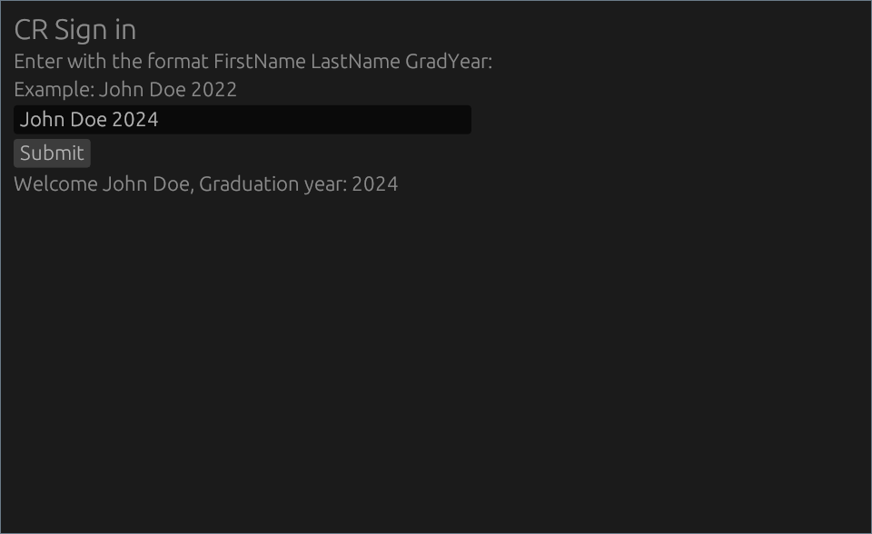

#### Shop attendance tracker

Stores shop attendance in a sqlite database with a gui to access it. When the admin password is entered into the box it exposes an export to json button which exports to a named file based on the time in the ./dumps folder.

Requires sqlite3, Rust, and probably more.

Only texted on Linux but should work on windows.

Code is very janky atm but functional-mostly.

##### preview

